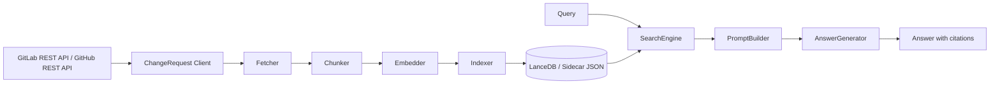

# DevVault System Overview

## 1. システムの目的
本システムは、GitLab Merge Request と GitHub Pull Request を共通の ChangeRequest モデルへ正規化し、以下の問いに高速に答えるための RAG 基盤です。
- 過去に同様の障害にどう対処したか
- 特定ファイルへのレビュー指摘履歴
- ChangeRequest 議論の経緯と根拠

## 2. 全体アーキテクチャ

## 3. レイヤー構成
- `config`: 環境変数と定数
- `types`: ChangeRequest / 検索 / チャンク型
- `ingestion`: 収集・分割・埋め込み・保存
- `retrieval`: 検索・フィルタ・再ランキング
- `generation`: プロンプト生成・回答生成
- `scripts`: CLI 実行

## 4. 実装上の現在地
- provider 差分は `gitlab-client.ts` / `github-client.ts` で吸収し、その後は共通の ChangeRequest フローに寄せている。
- `vectordb` は LanceDB mirror の維持に使い、sidecar JSON (`_chunks.json`) を現行の正本として検索に使っている。
- 検索は in-memory のハイブリッド検索で、vector 類似度と BM25 を RRF で統合している。
- 回答生成は `ANSWER_MODE` で `extractive` と `llm` を明示的に切り替える。
