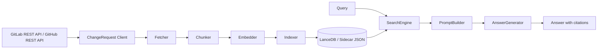
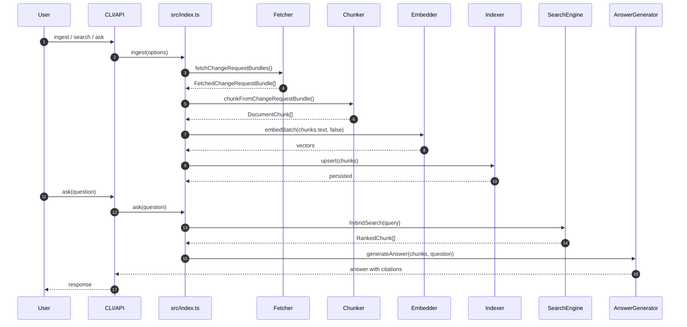

# DevVault System Overview

## 1. システムの目的
本システムは、GitLab Merge Request と GitHub Pull Request を共通の ChangeRequest モデルへ正規化し、レビュー履歴を再利用可能なナレッジとして扱うための RAG 基盤です。

開発現場では、過去の変更履歴は大量に残っていても、次のような問いに素早く答えるのは簡単ではありません。
- 過去に同様の障害にどう対処したか
- 特定ファイルにどのようなレビュー指摘が繰り返し入っているか
- なぜその実装や修正方針になったのか
- 変更の背景説明、コメント議論、実際の diff をまとめて確認したい

DevVault の目的は、これらを単なる全文検索ではなく、「変更要求」「レビューコメント」「diff」をまとめた文脈付きの知識として検索し、出典付きで再提示できるようにすることです。

このシステムが重視していることは次の 4 点です。
- 過去変更の再発見性: タイトルや本文だけでなく、コメントや diff からも関連事例を探せること
- 文脈の保持: 単発コメントではなく、どの MR / PR のどの議論か分かること
- 出典の明示: 回答に必ず MR / PR 番号、作者、URL を付けて検証可能にすること
- provider 横断の一貫性: GitLab と GitHub を同じ検索体験で扱えること

## 2. RAG とは何か
RAG は Retrieval-Augmented Generation の略で、先に関連情報を検索し、その結果を材料として回答を作る方式です。

一般的な LLM 単体の回答では、モデル内部の学習知識に頼るため、社内 MR / PR のようなローカル知識や最新の議論経緯を正確に扱いにくいことがあります。RAG では次の 2 段階に分けます。
- Retrieval: 質問に関連する文書断片を検索する
- Generation: 検索で見つかった断片だけを根拠として回答を作る

DevVault では、社内の ChangeRequest 履歴を検索対象にしているため、「モデルに知っていてほしい」のではなく「必ず過去の記録を根拠に答えてほしい」が前提です。そのため、RAG の採用理由は精度よりもまず検証可能性と再現性にあります。

## 3. なぜ DevVault で RAG を使うのか
レビュー履歴の活用では、単に似た単語を含む MR / PR を探せれば十分ではありません。実際には次の難しさがあります。
- 事象名と実装語彙が一致しない。たとえば「500 エラー」と「接続プール枯渇」は表現が違う。
- 有用な情報が description ではなく discussion や diff note にしかないことがある。
- 1 件の MR / PR が長く、そのままでは検索・回答に使いにくい。
- 回答だけ見ても、どの変更に基づくか分からないと現場では使えない。

これに対して DevVault は、検索で関連チャンクを絞り込み、その結果だけを使って回答する構成にしています。これにより、質問ごとに根拠がどの MR / PR から来たか追跡できます。

## 4. 全体アーキテクチャ

## 5. 全体シーケンス

## 6. RAG を構成する各工程
### 6.1 収集
`gitlab-client.ts` / `github-client.ts` と `fetcher.ts` が、MR / PR 本体、discussion、diff を取得します。

この工程が担うこと:
- provider 固有 API を共通モデルへ寄せる
- 変更要求本体と議論、コード差分をまとめて bundle 化する
- 以降の処理が provider 差分を意識しなくてよい状態にする

この工程で気をつけていること:
- GitLab と GitHub の差分を client に閉じ込め、後段を共通処理にする
- discussion と diff を落とさず取得し、表面的なタイトル検索に寄らないようにする
- ページネーションや rate limit retry を吸収して、取り込み欠落を減らす

### 6.2 チャンク化
`chunker.ts` が ChangeRequest を `DocumentChunk` の配列に分解します。RAG におけるチャンクとは、検索と回答の単位になる小さな文書片です。

この工程が担うこと:
- 長い MR / PR を検索しやすい大きさに分割する
- 説明文、レビューコメント、diff note、コード差分を別々の意味単位として扱う
- 各断片に出典情報と文脈情報を付与する

この工程で気をつけていること:
- description は見出しや段落ごとに分け、意味の切れ目を保つ
- comment は 1 コメント 1 チャンクを基本にしつつ前後文脈を持たせる
- diff note は `file:line` を残し、どのコード位置への指摘か分かるようにする
- 巨大 diff はそのまま保持しすぎず、1000 行超では要約へフォールバックする
- system note や絵文字のみのノイズを除外し、検索ノイズを減らす

### 6.3 エンベディング
`embedder.ts` が各チャンクやクエリをベクトル化します。エンベディングとは、文章の意味的な近さを計算できる数値表現への変換です。

この工程が担うこと:
- テキストを意味検索用ベクトルへ変換する
- 表現ゆれがあっても近い内容を拾えるようにする
- クエリと文書を同じベクトル空間で比較可能にする

この工程で気をつけていること:
- E5 形式の prefix を document と query で分ける
- 保存本文には prefix を混ぜず、embedding 時だけ付与する
- バッチ化しつつ 1 件ごとの埋め込み品質を保つ
- 実モデル前提にして、失敗時に曖昧な代替値で進めない

### 6.4 インデックス化
`indexer.ts` が埋め込み済みチャンクを永続化します。

この工程が担うこと:
- 検索対象チャンクを読み出せる形で保存する
- 同一 ChangeRequest の再取り込み時に古い断片を置き換える
- 現在の検索経路が安定して読める正本を維持する

この工程で気をつけていること:
- `project_id:change_request_number` 単位で再構築し、差分の取りこぼしを減らす
- `source_id` で重複排除する
- sidecar JSON を正本にして、検索経路を単純に保つ
- LanceDB は mirror として維持し、将来の native retrieval に備える

### 6.5 検索
`search.ts` が hybrid search を実行します。DevVault ではベクトル検索と BM25 を併用しています。

この工程が担うこと:
- 意味的に近いチャンクと、単語一致が強いチャンクの両方を拾う
- フィルタで対象を絞る
- RRF で順位を統合し、上位候補を決める

この工程で気をつけていること:
- vector 検索だけに寄せず、BM25 を併用して明示的なキーワードにも強くする
- `author`, `filePathLike`, `projectId`, `targetBranch` などで対象を絞れるようにする
- 最後は RRF で統合し、どちらか一方に極端に依存しないようにする

### 6.6 回答生成
`prompt-builder.ts` と `answer-generator.ts` が、検索結果をそのまま返すか、LLM で要約して返します。

この工程が担うこと:
- 検索結果を回答可能な形式に整える
- 出典情報を落とさずに利用者へ返す
- extractive と llm の 2 モードを切り替える

この工程で気をつけていること:
- system 指示で「検索結果のみに基づく回答」を明示する
- MR / PR 番号、author、URL をプロンプトと回答の両方で扱う
- 該当なしなら無理に埋めず、見つからなかったと返す

## 7. システムの目的を達成するための設計方針
DevVault の目的は「過去の変更や議論を、後から再利用できる形で正確に見つけること」です。これを実現するために、各工程で次の点を優先しています。

- 知識の単位を MR / PR 本体だけにしない
  review comment や diff note に重要な知識が埋まるため、description だけを対象にしない。

- 断片化しても出典を失わない
  チャンクごとに `change_request_number`, `author`, `web_url`, `source_type`, `file_path` を持たせ、検索後も原典へ戻れるようにする。

- 意味検索と単語検索の両方を使う
  表現ゆれ対策には embedding、固有語やファイル名には BM25 が効くため、片方だけではなくハイブリッドにする。

- 回答生成を検索結果に従属させる
  LLM を使う場合も、自由回答ではなく検索結果ベースに限定することで、もっともらしい誤答を抑える。

- provider 差分を早い段階で吸収する
  GitLab / GitHub の違いを後段へ漏らさないことで、検索・回答の振る舞いを安定させる。

- 検索対象の更新に追従しやすくする
  incremental ingest と再取り込み置換により、古い情報が残り続けることを避ける。

## 8. レイヤー構成
- `config`: 環境変数と定数
- `types`: ChangeRequest / 検索 / チャンク型
- `ingestion`: 収集・分割・埋め込み・保存
- `retrieval`: 検索・フィルタ・再ランキング
- `generation`: プロンプト生成・回答生成
- `scripts`: CLI 実行

## 9. コードリーディングの入口
- 入口は `src/index.ts`。`ingest` / `search` / `ask` が各レイヤーをどう束ねるかを見る。
- ingest 系は `fetcher.ts` → `chunker.ts` → `embedder.ts` → `indexer.ts` の順で追う。
- ask 系は `search.ts` → `prompt-builder.ts` → `answer-generator.ts` の順で追う。

## 10. 実装上の現在地
- provider 差分は `gitlab-client.ts` / `github-client.ts` で吸収し、その後は共通の ChangeRequest フローに寄せている。
- `vectordb` は LanceDB mirror の維持に使い、sidecar JSON (`_chunks.json`) を現行の正本として検索に使っている。
- 検索は in-memory のハイブリッド検索で、vector 類似度と BM25 を RRF で統合している。
- 回答生成は `ANSWER_MODE` で `extractive` と `llm` を明示的に切り替える。
