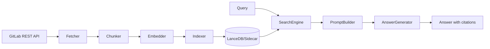

# System Overview

## 1. システムの目的
本システムは、GitLab Merge Request関連情報をナレッジベース化し、以下の問いに高速に答えるための基盤です。
- 過去に同様の障害にどう対処したか
- 特定ファイルへのレビュー指摘履歴
- MR議論の経緯と根拠

## 2. 全体アーキテクチャ

## 3. レイヤー構成
- `config`: 環境変数と定数
- `types`: GitLab API/検索/チャンク型
- `ingestion`: 収集・分割・埋め込み・保存
- `retrieval`: 検索・フィルタ・再ランキング
- `generation`: プロンプト生成・回答生成
- `scripts`: CLI実行

## 4. 実装上の現在地
- Vector DBとして `vectordb` を利用（接続失敗時はsidecar JSONフォールバック）。
- BM25は現時点で「BM25ライクな簡易TFスコア」で実装。
- LLM APIキー未設定時は、検索結果ベースのフォールバック回答を返す。
