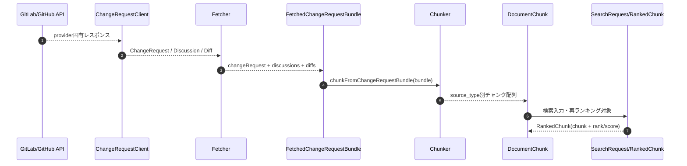

# DevVault Data Model

## 1. ChangeRequest 入力モデル
`src/types/review.ts`:
- `ChangeRequest`: provider 非依存の ChangeRequest 本体
- `ChangeRequestDiscussion` / `ChangeRequestNote`: スレッドとコメント
- `DiffPosition`: diff コメント位置
- `ChangeRequestDiff`: ファイル差分
- `FetchedChangeRequestBundle`: `changeRequest` / `discussions` / `diffs` の取得単位
- `ChangeRequestClient`: provider ごとの取得 interface

`src/types/gitlab.ts` は GitLab 固有の別名を提供します。

## 2. モデル変換シーケンス

## 3. 正規化チャンクモデル
`src/types/chunk.ts` の `DocumentChunk` が RAG の統一単位です。
主な項目:
- 識別: `id`, `source_id`, `change_request_number`
- 検索: `vector`, `text`, `source_type`
- フィルタ: `author`, `file_path`, `created_at`, `target_branch`, `project_id`
- 出典: `source_system`, `web_url`, `parent_title`
- 文脈: `discussion_context`, `chunk_index`, `total_chunks`

`source_type` は現在以下の 4 種です。
- `change_request_description`
- `change_request_comment`
- `change_request_diff_note`
- `change_request_diff`

## 4. コードリーディングの観点
- provider 差分は `ChangeRequestClient` 実装に閉じ込め、`FetchedChangeRequestBundle` 以降は共通フローになる。
- `DocumentChunk` は ingest, search, generation で同じ型を引き回すので、まずこの項目を把握するとコードが追いやすい。
- `source_id` は永続化時の重複排除キー、`id` は検索中の一時識別子として使われる。

## 5. 検索 I/O
`src/types/search.ts`:
- 入力: `SearchRequest`（query、topK、rerankTopN、weights、filters 等）
- 出力: `RankedChunk`（vectorRank / bm25Rank / score 付き）
