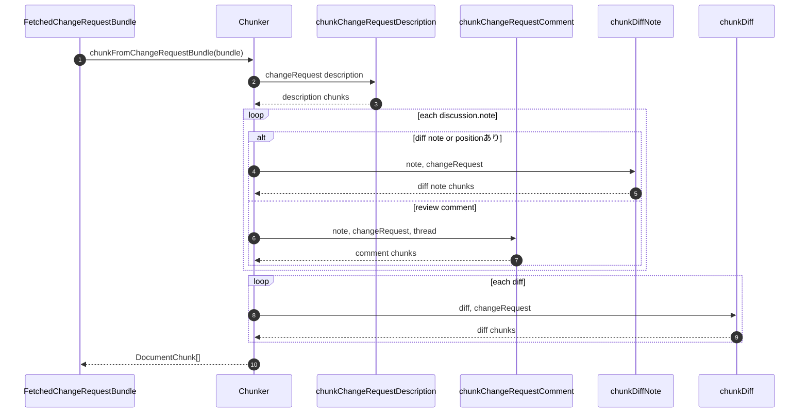

# DevVault Ingestion

## 1. Provider クライアント
- `src/ingestion/gitlab-client.ts`
  - `listChangeRequests`
  - `listDiscussions`
  - `listDiffs`
- `src/ingestion/github-client.ts`
  - `listChangeRequests`
  - `listDiscussions`
  - `listDiffs`

対応済み仕様:
- Link ヘッダによるページネーション
- GitLab の `429 Retry-After` リトライ
- GitHub の `403/429` リトライ
- GitHub は `GITHUB_OWNER` + `--project-id <repo>` で対象 repo を解決

## 2. Ingestion シーケンス

```mermaid
sequenceDiagram
  autonumber
  participant CLI as scripts/ingest.ts
  participant Core as src/index.ts
  participant Client as GitLabClient/GitHubClient
  participant Fetcher
  participant Chunker

  CLI->>Core: ingest({ projectId, since, provider })
  Core->>Client: createChangeRequestClient()
  Core->>Fetcher: fetchChangeRequestBundles(client, options)
  Fetcher->>Client: listChangeRequests(projectId, since)
  Client-->>Fetcher: ChangeRequest[]
  loop each ChangeRequest with concurrency
    Fetcher->>Client: listDiscussions(projectId, iid)
    Fetcher->>Client: listDiffs(projectId, iid)
    Client-->>Fetcher: discussions / diffs
  end
  Fetcher-->>Core: FetchedChangeRequestBundle[]
  Core->>Chunker: chunkFromChangeRequestBundle(bundle)
  Chunker-->>Core: DocumentChunk[]
```

## 3. 取得オーケストレーション
`src/ingestion/fetcher.ts`:
- ChangeRequest 一覧取得後、ChangeRequest ごとに Discussion / Diff を並列取得
- `concurrency` 指定で同時実行制御
- 返り値は `FetchedChangeRequestBundle[]`

## 4. チャンキング
`src/ingestion/chunker.ts`:
- `chunkChangeRequestDescription`: 見出し / 段落ベース分割
- `chunkChangeRequestComment`: 1 コメント 1 チャンク + 前後文脈
- `chunkDiffNote`: `file:line` 付き diff コメント
- `chunkDiff`: hunk 分割。1000 行超は要約へフォールバック
- `chunkFromChangeRequestBundle`: bundle 全体を `DocumentChunk[]` へ展開
- 除外: `system note`, 絵文字のみ

## 5. チャンキング詳細シーケンス

## 6. E5 プレフィックス
`src/ingestion/embedder.ts` 経由で embedding 時のみ付与する。
- ドキュメント: `passage: ...`
- クエリ: `query: ...`

保存される `chunk.text` 自体にはプレフィックスを持たせない。

## 7. コードリーディングの観点
- provider API の差分確認は `gitlab-client.ts` / `github-client.ts` を見てから `fetcher.ts` に戻ると流れがつながる。
- chunker は `source_type` ごとに関数が分かれているので、検索対象の種類ごとに個別に読みやすい。
- 差分コメント判定は `note.position` または `note.type` に依存するので、Discussion 正規化の仕様確認ポイントになる。
