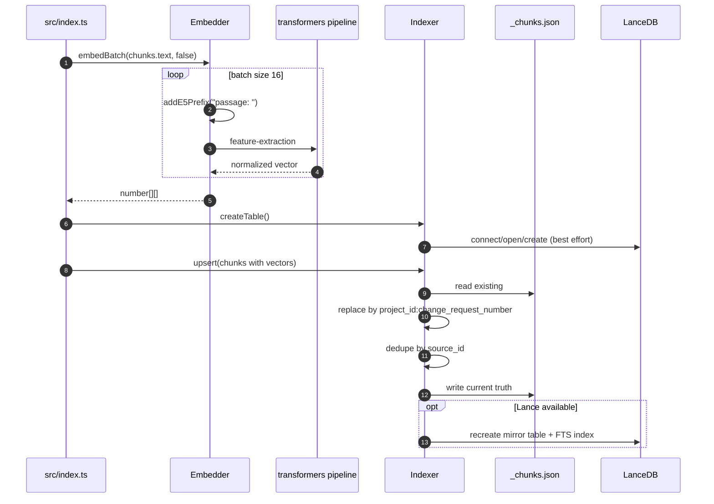

# DevVault Embedding And Indexing

## 1. Embedding
`src/ingestion/embedder.ts`:
- モデル: `Xenova/multilingual-e5-small`（環境変数で変更可能）
- `embed(text, isQuery)` / `embedBatch(texts, isQuery)` を提供
- 実モデル前提。モデル初期化や実行に失敗した場合はエラーにする
- テスト用モックはアプリ本体ではなくテスト側で差し込む
- `embedBatch` は 16 件ずつに分けて `embed()` を並列実行する

## 2. Embedding と Indexing のシーケンス

## 3. Indexing
`src/ingestion/indexer.ts`:
- LanceDB 接続・テーブル作成
- `source_id` をキーに重複排除
- 同一 ChangeRequest は `project_id:change_request_number` 単位で旧チャンクを置き換える
- sidecar (`_chunks.json`) を現行の正本として永続化する
- LanceDB は将来の native retrieval に備えた write-through mirror として扱う
- `readAll()` は sidecar から全件読込する

## 4. コードリーディングの観点
- `Embedder.embed()` は prefix 付与とモデル呼び出しだけを担当し、prefix なし本文は `chunk.text` に残る。
- `LanceIndexer.upsert()` は sidecar 更新が本処理で、LanceDB 更新は mirror として後続で実施される。
- 同一 ChangeRequest の再取り込みでは `project_id:change_request_number` 単位で丸ごと置き換えるため、差分更新ではなく再構築型になる。

## 5. 注意点
現在の検索実装は sidecar 読込ベースです。LanceDB ネイティブの `hybrid_search()` 直利用は未実装で、移行要否は TODO として残しています。
