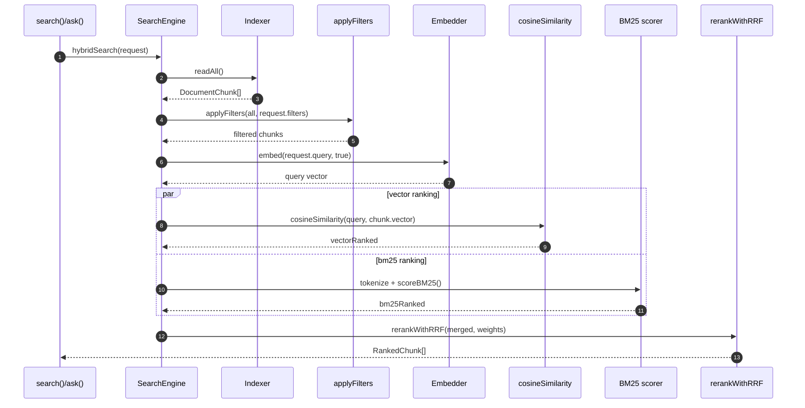

# DevVault Retrieval

## 1. 検索エンジン
`src/retrieval/search.ts` の `SearchEngine.hybridSearch()` が中心です。

処理手順:
1. フィルタ適用
2. クエリ embedding
3. ベクトル類似度ランキング（コサイン）
4. キーワードランキング（BM25）
5. RRF で統合し上位 N 件を返却

## 2. Retrieval シーケンス

## 3. フィルタ
`src/retrieval/filter-builder.ts`:
- 対応: `sourceTypes`, `createdAfter`, `author`, `filePathLike`, `targetBranch`, `projectId`
- `buildWhereClause()` は説明用 SQL 文字列
- `applyFilters()` は実際の絞り込み
- `projectId` は `number | string` の両方を扱える

## 4. Re-ranking
`src/retrieval/reranker.ts`:
- Reciprocal Rank Fusion を実装
- デフォルト重み: vector `0.7`, bm25 `0.3`
- vector と BM25 の両方で上位に来る chunk を強く評価する

## 5. コードリーディングの観点
- 検索経路は `readAll()` で sidecar 全件を読む前提なので、DB クエリ最適化ではなく in-memory 計算が中心になる。
- `vectorRanked` と `bm25Ranked` は別々に topK を切ってからマージするため、どこで候補集合が縮むかを追うと挙動を理解しやすい。
- クエリ embedding だけ `isQuery=true` で `query: ` prefix が付く点は、ingest 時の埋め込みと対になる。
