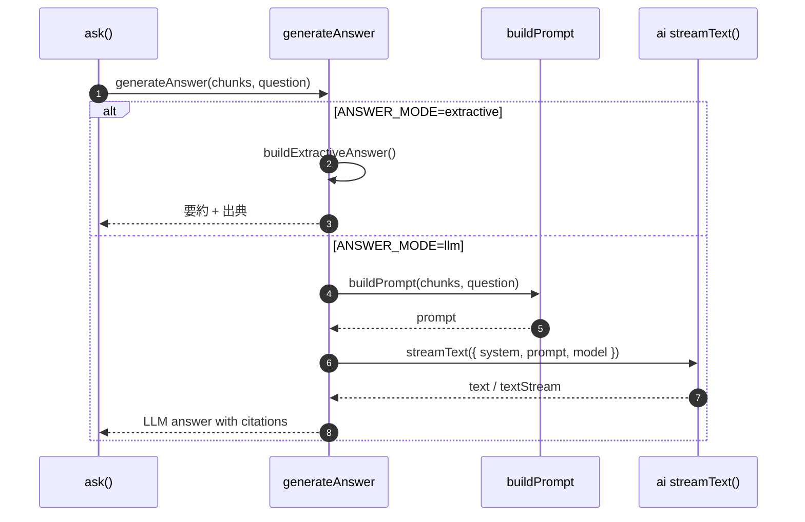

# DevVault Generation

## 1. プロンプト生成
`src/generation/prompt-builder.ts`:
- 検索チャンクを列挙
- `source_type` / MR または PR 番号 / author / 日時 / URL / text を明示
- provider に応じて出典ラベルを `MR` / `PR` で出し分ける
- 「検索結果のみに基づく回答」を system 指示する

## 2. Generation シーケンス

## 3. 回答生成
`src/generation/answer-generator.ts`:
- `ANSWER_MODE=extractive`: 検索結果の抜粋ベースで回答
- `ANSWER_MODE=llm`: `LLM_API_KEY` 必須で `ai` の `streamText()` を利用
- LLM 実行失敗時はエラーを返す

## 4. 出力方針
- 出典付き
- 検索結果外の情報を極力含めない
- 該当なしを正直に返す

## 5. コードリーディングの観点
- `buildPrompt()` はチャンクの見せ方を決めるだけで、モデル呼び出しは `generateAnswer()` に閉じている。
- `extractive` は LLM 不要のため、検索結果だけで回答品質を確認したいときの基準線になる。
- 実装上、`llm` モード失敗時の自動フォールバックはなく明示的にエラーになる。運用時は `ANSWER_MODE` と API キーの整合を先に確認する。
