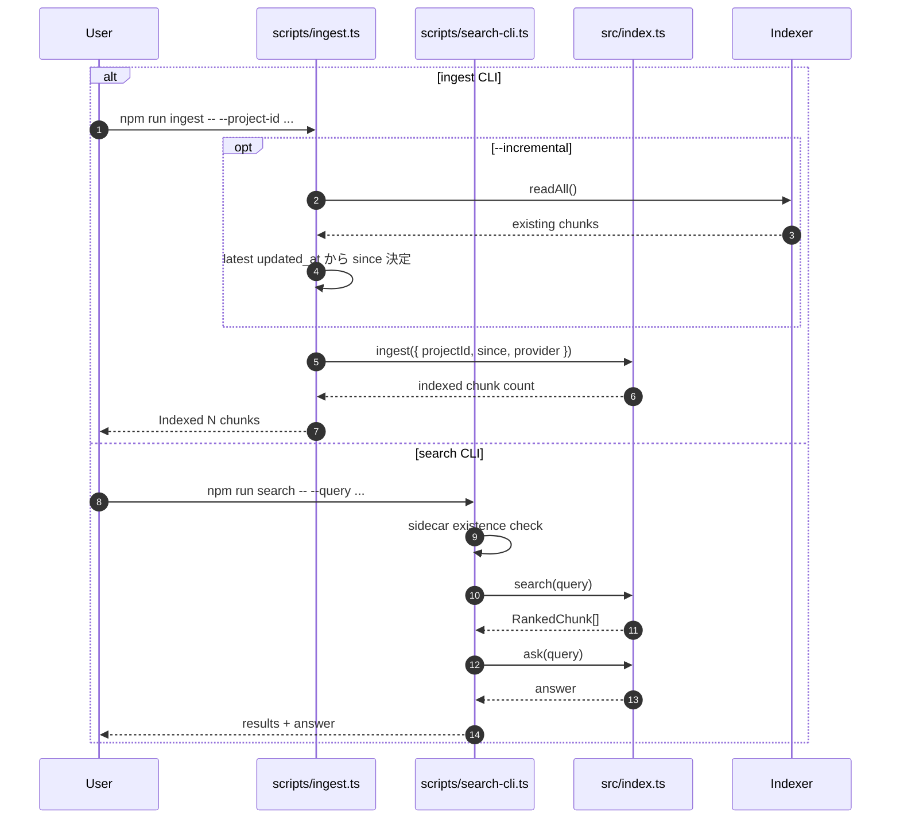

# DevVault Interfaces

## 1. Public API
`src/index.ts`:
- `ingest({ projectId, since, provider })`
- `search({ query, ... })`
- `ask(question)`

## 2. Interface シーケンス


## 3. CLI
- `scripts/ingest.ts`
  - `--project-id`
  - `--since`
  - `--provider gitlab|github`
  - `--incremental`
- `scripts/search-cli.ts`
  - `--query` でワンショット
  - 引数なしで対話モード

`src/cli.ts` の簡易 CLI でも `ingest` / `ask` を提供する。

## 4. 実行例
```bash
npm run ingest -- --project-id 123 --since 2024-01-01
npm run ingest -- --provider github --project-id web --since 2024-01-01
npm run ingest -- --provider gitlab --project-id 123 --incremental
npm run search -- --query "ログインの500エラー対応"
```

## 5. コードリーディングの観点
- 本命の運用 CLI は `scripts/ingest.ts` と `scripts/search-cli.ts`。`src/cli.ts` は薄いラッパーとして読む。
- `--incremental` の since 解決は CLI 側で行い、その後の ingest 本体は通常フローに入る。
- `search-cli.ts` は `search()` と `ask()` を両方呼ぶので、検索結果表示と回答生成の接続点として分かりやすい。
