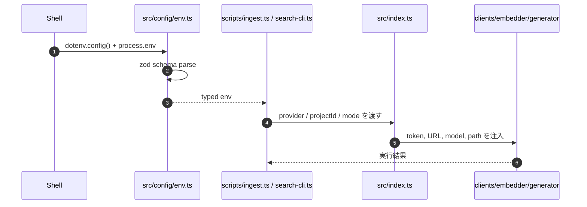
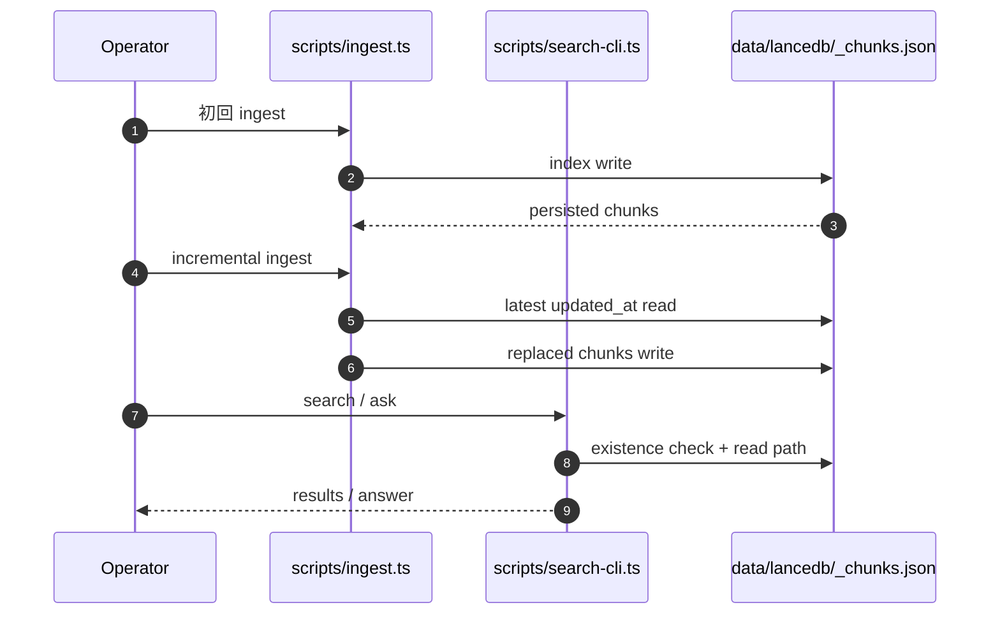

# DevVault Config And Runbook

## 1. 主要環境変数
- `SCM_PROVIDER`
- `GITLAB_URL`
- `GITLAB_TOKEN`
- `GITHUB_URL`
- `GITHUB_TOKEN`
- `GITHUB_OWNER`
- `LANCEDB_PATH`
- `EMBEDDING_MODEL`
- `ANSWER_MODE`
- `LLM_PROVIDER`
- `LLM_API_KEY`
- `LLM_MODEL`
- `INGEST_SINCE`

詳細は `.env.example` を参照。

## 2. 設定反映シーケンス


## 3. 初期セットアップ
```bash
npm install
cp .env.example .env
npm run build
npm test
```

## 4. バッチ取り込み
GitLab:
```bash
npm run ingest -- --provider gitlab --project-id 123 --since 2024-01-01
```

GitHub:
```bash
npm run ingest -- --provider github --project-id web --since 2024-01-01
```

## 5. 差分取り込み
```bash
npm run ingest -- --provider gitlab --project-id 123 --incremental
```

`--incremental` は既存 index の最新 `updated_at` を基準に `since` を決める。

## 6. 運用フローシーケンス


## 7. 検索
```bash
npm run search -- --query "ログインの500エラー対応"
```

## 8. 運用メモ
- `ANSWER_MODE=extractive` は検索結果ベースの簡易回答、`ANSWER_MODE=llm` は LLM 回答
- `ANSWER_MODE=llm` では `LLM_API_KEY` が必須
- GitLab ingest では `GITLAB_TOKEN`、GitHub ingest では `GITHUB_TOKEN` と `GITHUB_OWNER` が必要
- GitHub の `projectId` は数値ではなく repo 名文字列を使う

## 9. コードリーディングの観点
- `env.ts` が全設定の単一入口で、script や core はここから解決済み値を読む。
- 設定ミスの多くは `createChangeRequestClient()` と `generateAnswer()` のガード条件で顕在化する。
- 運用導線を追うなら `scripts/ingest.ts` と `scripts/search-cli.ts` を `env.ts` と並べて読むと依存関係が見やすい。
