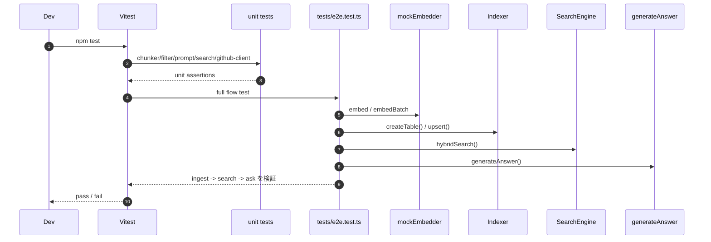

# DevVault Testing

## 1. テスト構成
- `tests/chunker.test.ts`: ChangeRequest チャンキング仕様
- `tests/filter-builder.test.ts`: フィルタ構築
- `tests/prompt-builder.test.ts`: プロンプト生成
- `tests/search.test.ts`: ハイブリッド検索の順位
- `tests/github-client.test.ts`: GitHub client の正規化
- `tests/e2e.test.ts`: ingest → search → answer

## 2. テストシーケンス


## 3. 実行
```bash
npm run build
npm test
```

## 4. 検証済み事項
- build 成功: `npm run build`
- test 成功: 全 11 テスト
- e2e ではテスト側の mock embedder で ingest → search → answer が完走する

## 5. コードリーディングの観点
- 実装の期待動作を最短で掴むなら `tests/e2e.test.ts` が全体の縮図になる。
- embedder は本番実装を直接使わず、テスト側の `mockEmbedder` を注入して determinism を確保している。
- unit test は各レイヤーの境界を示しているので、章ごとのドキュメントと対応づけて読むと責務分割が分かりやすい。

## 6. 未実施の実環境検証
- 実 GitLab API に対する統合試験（認証情報が必要）
- 実 GitHub API に対する統合試験（認証情報が必要）
- 実 LLM プロバイダへのストリーミング応答確認
